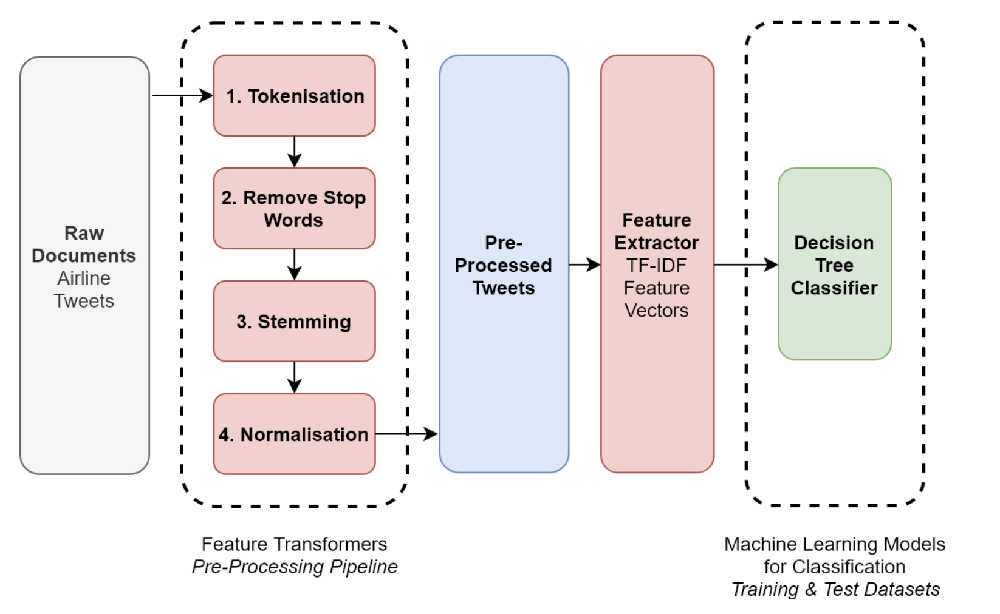

# 🧠 Generative AI Learning Journey

Welcome to my repository for learning Generative AI. This section focuses on the foundational concepts of **Natural Language Processing (NLP)**, which are essential before diving into complex Large Language Models (LLMs).

## 📚 Module 1: NLP Fundamentals & Text Preprocessing

This module covers the essential steps to clean and prepare raw text data so that machines can understand it.

### 1. Tokenization
Tokenization is the very first step in NLP. It involves breaking down text into smaller units (tokens) like sentences or words.
* **[01_Tokenization_Basics](./src/nlp/tokenization_basic.ipynb)**
  * **Concepts Covered:** NLP Terminologies (Corpus, Documents, Vocabulary, Words).
  * **Objective:** Understand how text is represented and the theory behind building a vocabulary.
* **[02_Tokenization_Practical](./src/nlp/tokenization_practical.ipynb)**
  * **Concepts Covered:** Practical implementation using NLTK (`sent_tokenize`, `TreebankWordTokenizer`).
  * **Objective:** Write Python code to split paragraphs into sentences and sentences into individual words.

### 2. Stop Words Processing
Stop words are common words (like "the", "is", "in") that carry little meaning and can often be removed to reduce noise and save computation.
* **[03_Stopwords_Processing](./src/nlp/stopwords_processing.ipynb)**
  * **Concepts Covered:** What are stop words, why remove them, and how to filter them out.
  * **Objective:** Learn to clean tokenized arrays by removing unhelpful "glue" words using NLTK's stopwords list.

### 3. Text Normalization: Stemming & Lemmatization
Because words can appear in various forms (e.g., "run", "running", "ran"), text normalization reduces them to their base form, shrinking the vocabulary size.
* **[04_Stemming_and_Lemmatization](./src/nlp/stemming_lemmatization_basic.ipynb)**
  * **Concepts Covered:** * **Stemming:** Rule-based heuristic chopping of suffixes (e.g., *running* $\to$ *run*).
    * **Lemmatization:** Dictionary-based reduction to meaningful root words.
  * **Objective:** Understand the differences between the two methods and when to use which.

---
*Stay tuned as I add more modules on Embeddings, Attention Mechanisms, and LLMs!*